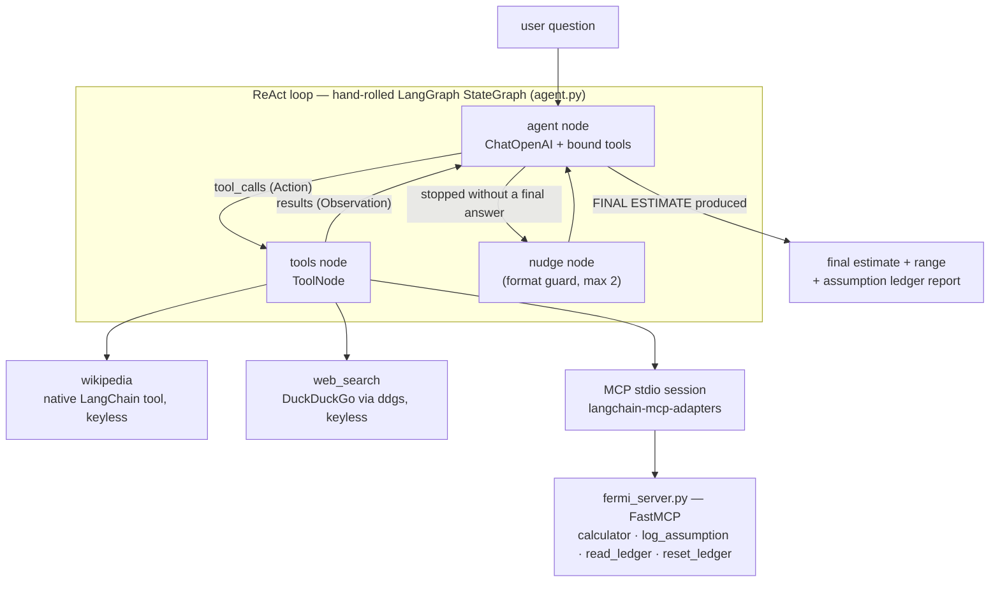

# 🕵️ Fermi Detective

A **ReAct agent** that answers Fermi estimation questions — *"How many piano tuners work in Warsaw?"* — not by guessing, but by **decomposing the estimate, grounding every factor in a real source, logging each assumption in an auditable ledger, and computing only through a calculator tool**. The answer always comes with an uncertainty range and a printable audit trail.

Built with **LangGraph** (the ReAct loop is hand-rolled as a `StateGraph`, not imported), **OpenAI** models via `langchain-openai`, and a custom **MCP server** for the domain tools. Every external data source is keyless — the only credential the project needs is an OpenAI API key.

```
$ uv run main.py "How many piano tuners work in Warsaw?"
```

## Why this design

A ReAct agent shows its value when the *reasoning loop itself* is the product. Fermi estimation is exactly that: each Thought → Action → Observation cycle is one step of the estimation methodology, so the streamed trace doubles as the worked solution. Three rules turn it from a chatbot into an instrument:

1. **No unlogged numbers.** Every quantity must pass through `log_assumption` (value, unit, low/high bounds, source, rationale) before it may be used. The ledger is the audit trail.
2. **No mental arithmetic.** All math goes through the `calculator` tool — including propagating the low/high bounds (the agent has to reason that a *divisor's* high bound minimizes the result).
3. **Sources over vibes.** Encyclopedic facts come from `wikipedia`, statistics from `web_search`; only when both fail may the agent fall back to an explicit `own estimate` with wide bounds.

## Architecture



The ReAct loop is three nodes and one conditional edge (`agent.py`):

```
START → agent ──(tool_calls?)──▶ tools ──▶ agent → …
          │ no tool calls
          ├── contains "FINAL ESTIMATE" (or nudged twice already) → END
          └── otherwise → nudge → agent
```

The `agent` node is the LLM with tools bound to it: it writes a `Thought:`, then either requests a tool (**Action**) or emits the final answer. The `tools` node executes the request and appends the result (**Observation**). The `nudge` node is a **format guard**: small models occasionally *narrate* a tool call in prose without actually emitting it, which would otherwise end the graph silently — instead the graph refuses to terminate on a message that is neither an action nor a final answer and pushes the agent to continue (bounded at two nudges). This turned a silent early-exit observed in the benchmark into a self-recovering run. The prebuilt `create_agent` in LangChain 1.x compiles to the same core shape — it is hand-rolled here to make the pattern explicit and to add the guard.

### Tools

| Tool | Kind | Source of data | Purpose |
|---|---|---|---|
| `calculator` | **custom, served over MCP** | pure-Python safe AST evaluator | all arithmetic, incl. bound propagation; whitelisted syntax only (`+ - * / // % **`, e-notation, `pi`, `e`) |
| `log_assumption` | **custom, served over MCP** | in-server ledger | records every number with unit, bounds, source, rationale |
| `read_ledger` / `reset_ledger` | custom, MCP, **host-only** | in-server ledger | the CLI resets before a run and reads for the final report — the model never gets them, so it cannot tamper with its own audit trail |
| `wikipedia` | native LangChain `@tool` | MediaWiki + REST APIs (keyless) | encyclopedic facts: populations, sizes, official figures |
| `web_search` | native LangChain `@tool` | DuckDuckGo via `ddgs` (keyless) | statistics, rates, prices |

Tool failures are returned as plain `... ERROR:` strings instead of raising — the agent visibly reads the error, fixes its input and retries, which is the ReAct self-correction loop at work.

### The MCP part, and a subtlety worth knowing

The custom tools are not registered as plain Python functions. They live in **`fermi_server.py`, a FastMCP server** spoken to over stdio through `langchain-mcp-adapters` — i.e. the agent consumes them exactly as it would consume any third-party MCP server, and any MCP-capable client (Claude Desktop, an IDE) could consume them too.

The subtlety: `MultiServerMCPClient.get_tools()` opens a **fresh session per tool call**, which for a stdio server means a fresh process — and the assumption ledger would be wiped between calls. The fix is the persistent-session pattern, which this project uses (`main.py`):

```python
async with client.session("fermi") as session:
    tools = await load_mcp_tools(session)   # one server process for the whole question
```

## Example run (abridged trace from a real session)

```
❓ How many piano tuners work in Warsaw?
🤔 To estimate the number of piano tuners in Warsaw, we can break down the
   problem into … population × ownership rate × tuning frequency ÷ pianos-per-tuner
🔧 Action: wikipedia({"query": "Warsaw"})
👁  Observation[wikipedia]: Best match: Warsaw … population is officially
    estimated at 1.87 million residents …
🔧 Action: log_assumption({"name": "Population of Warsaw", "value": 1870000, …
👁  Observation[log_assumption]: Logged assumption #1: Population of Warsaw
    = 1.87 million people [1.8 million – 1.9 million] (source: Warsaw)
🔧 Action: web_search({"query": "piano ownership rate in Poland"})
👁  Observation[web_search]: SEARCH ERROR: DDGSException('No results found.').
    Do not retry the same query — use wikipedia instead, or make an explicit
    own estimate with wide bounds.
🔧 Action: log_assumption({"name": "Piano ownership rate in Poland",
           "value": 0.05, "low": 0.03, "high": 0.1, "source": "own estimate", …
🔧 Action: web_search({"query": "how often are pianos tuned per year"})
👁  Observation[web_search]: … tuning intervals can gradually extend to twice
    or once per year …
🔧 Action: log_assumption({"name": "Frequency of piano tuning", "value": 2, …
🔧 Action: web_search({"query": "how many pianos can a piano tuner service in a year"})
👁  Observation[web_search]: - Fermi's Piano Tuner - NASA (…) As a lecturer,
    Enrico Fermi used to challenge his classes with problems …
🔧 Action: log_assumption({"name": "Pianos per tuner", "value": 600,
           "low": 300, "high": 1000, …
🔧 Action: calculator({"expression": "1870000 * 0.05 * 2"})
👁  Observation[calculator]: 187000
🔧 Action: calculator({"expression": "187000 / 600"})
👁  Observation[calculator]: 311.667 (≈ 312)

FINAL ESTIMATE: 3.12e2 tuners (≈ 312 tuners)
RANGE: 2.0e2 - 5.0e2 tuners (≈ 200 – 500 tuners)
MOST SENSITIVE ASSUMPTION: Pianos per tuner

──── Assumption ledger (audit trail) ────
 # 1  Population of Warsaw: 1.87 million people   [1.8 million – 1.9 million]
      source: Warsaw — officially estimated at 1.87 million residents.
 # 2  Piano ownership rate in Poland: 0.05 pianos/person   [0.03 – 0.1]
      source: own estimate — assuming about 5% of households own a piano …
 # 3  Frequency of piano tuning: 2 tunes/year   [1 – 4]
      source: web_search — most pianos are tuned about twice a year …
 # 4  Pianos per tuner: 600 pianos/tuner/year   [300 – 1,000]
      source: web_search — based on typical working hours and tuning time.
```

Two things worth noticing. First, the `SEARCH ERROR` observation: DuckDuckGo found nothing for Polish piano-ownership rates, the tool failed *politely* (an error string, not an exception), and the agent fell back to an explicit own estimate with wide bounds — exactly what its method prescribes. Second, the fourth search happened to surface NASA's page about Enrico Fermi's original piano-tuner problem, which is the kind of detail you cannot script.

## Setup

Requires [uv](https://docs.astral.sh/uv/) and an OpenAI API key — no other accounts or keys. Any Python ≥ 3.10 works (developed on 3.14); uv finds or fetches an interpreter automatically.

```bash
uv sync                          # creates .venv from the pinned uv.lock
cp .env.example .env             # then put your OPENAI_API_KEY inside
```

No uv? Plain pip works too:

```bash
python3 -m venv .venv && source .venv/bin/activate
pip install langgraph langchain-openai langchain-core langchain-mcp-adapters mcp ddgs python-dotenv
```

## Usage

```bash
uv run main.py "How many piano tuners work in Warsaw?"
uv run main.py "How much would it cost to repaint the Eiffel Tower?"
uv run main.py --model gpt-5-mini "How many breaths does a person take in a lifetime?"
```

Default model is `gpt-4o-mini` (override with `--model` or `OPENAI_MODEL` in `.env`).

## Testing

**Smoke test — no API key needed.** Verifies the MCP server boots over stdio and exposes all four tools, the calculator computes and rejects bad input gracefully, ledger state persists across separate MCP calls within one session, and both keyless web tools return live data:

```bash
uv run smoke_test.py
```

**Benchmark — order-of-magnitude accuracy.** Runs 5 questions with known reference values through the agent; a question passes when the estimate lands within a factor of 10 of the reference (the usual bar for a Fermi estimate):

```bash
uv run eval.py
```

Latest run (gpt-4o-mini):

| # | Question | Reference | Agent estimate | Verdict |
|---|---|---|---|---|
| 1 | Piano tuners in Chicago | ~230 | 1.8e2 (range 137 – 274) | ✅ pass |
| 2 | Breaths in an 80-year lifetime | ~6.7e8 | 6.7e8 (range 5.0e8 – 8.4e8) | ✅ pass |
| 3 | Paint to repaint the Eiffel Tower | ~4.6e4 L | 2.3e3 L | ❌ fail |
| 4 | Tennis balls in a 747 cabin | ~3.5e6 | 8.7e6 (range 8.2e6 – 9.1e6) | ✅ pass |
| 5 | All gold ever mined | 2.16e5 t | 2.16e5 t | ✅ pass |

**4/5 within one order of magnitude.**

The benchmark earned its keep during development. The first run scored **2/5**: the agent mixed cm³ with liters inside one expression (tennis balls), multiplied *today's* gold production rate by 5,000 years of history instead of looking up the documented cumulative total, and once stopped mid-run without producing a final answer. Two added system-prompt rules — *unit discipline* (convert everything to one unit system before combining) and *look up famous totals directly first* — plus the nudge node lifted it to **4/5**. The remaining miss is instructive: the Eiffel Tower's painted area (~250,000 m²) only sometimes surfaces in search results; when it does, the agent lands within a factor of two of the official figure (~60 tonnes ≈ 46,000 L per campaign), and when it has to guess the area it undershoots. The agent's accuracy is bounded by what its searches surface — which is exactly what the assumption ledger makes visible.

## Requirements coverage

| Requirement | Where |
|---|---|
| **ReAct agent** | hand-rolled Thought/Action/Observation loop as a LangGraph `StateGraph` — `agent.py` |
| **LangChain / LangGraph framework** | `langgraph` graph + `langchain-core` tools/messages + `langchain-openai` LLM |
| **Answers queries via an LLM** | OpenAI chat models drive the loop (`ChatOpenAI`) |
| **Tools** | search engine (DuckDuckGo), Wikipedia, custom calculator + assumption ledger |
| **MCP instead of framework-specific tools** | custom tools served by own FastMCP server (`fermi_server.py`), consumed via `langchain-mcp-adapters` over a persistent stdio session |

## Project layout

```
agent.py             the ReAct loop (StateGraph), format-guard nudge + system prompt
fermi_server.py      FastMCP server: calculator, log_assumption, read/reset_ledger
web_tools.py         native LangChain tools: wikipedia, web_search (both keyless)
formatting.py        human-readable number rendering (34.5 trillion, 46,000)
main.py              CLI: MCP session, streaming trace, final report
smoke_test.py        keyless test of MCP server + tools
eval.py              order-of-magnitude benchmark
eval_questions.json  5 benchmark questions with reference values
pyproject.toml       project metadata + dependencies (uv.lock pins the full tree)
```

## Design notes & limitations

- **Wikipedia via stdlib `urllib`, deliberately:** Wikimedia's WAF fingerprints and 403-blocks popular Python HTTP clients (verified: identical request passes with `urllib`, fails with `httpx`). A descriptive `User-Agent` is sent per their policy.
- **The calculator is a whitelisted AST evaluator** (numbers, arithmetic operators, `pi`/`e` only) — safe by construction, no `eval`, no third-party math dependency.
- **Numbers are rendered for people** everywhere a human is the audience — the ledger report, tool confirmations and the final answer say `34.5 trillion`, `1.87 million` or `46,000` (see `formatting.py`), while the machine layer keeps exact scientific notation: the calculator returns both (`3.45e+13 (≈ 34.5 trillion)`) so chained calculations stay precise, the JSON ledger stores raw values, and the eval parser reads the scientific form.
- **DuckDuckGo can rate-limit** under rapid fire; the tool retries once with backoff and otherwise returns a readable `SEARCH ERROR:` so the agent falls back to Wikipedia or a wide-bounded own estimate.
- The final range comes from the agent combining logged bounds through the calculator — honest scenario analysis, not a formal Monte Carlo error propagation.
- Ideas for later: expose the web tools through MCP as well, add a LangSmith trace link, propagate uncertainty properly (log-normal factors), let a second "auditor" agent re-derive the estimate from the ledger alone.
