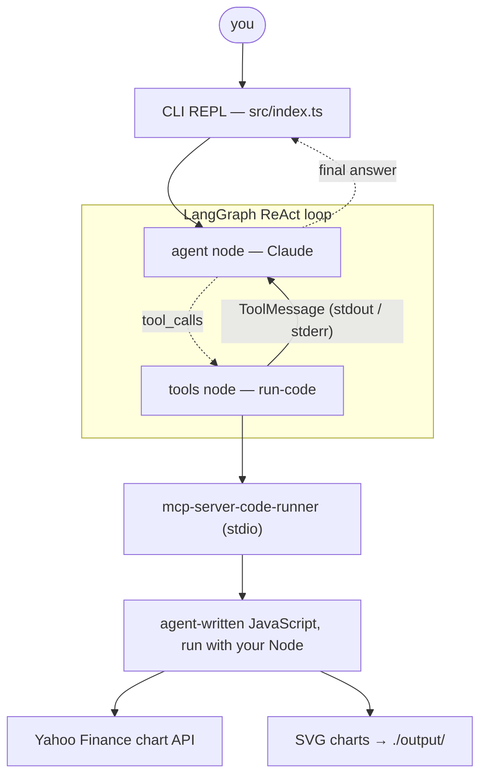

# Finance Research Agent — LangGraph.js + MCP

A stock & finance research agent built with **LangGraph.js** that answers market
questions by **writing and running JavaScript** through an **MCP server** —
no framework-specific tool definitions.



Ask things like:

- `What was NVDA's best month in 2025?`
- `Compare AAPL and MSFT over the last year: total return, volatility, and draw a comparison chart`
- `Which of the two had the worse max drawdown?` *(follow-ups keep context)*

The agent fetches adjusted closes from Yahoo Finance's public chart API (no data
API key needed), computes returns / volatility / drawdowns in code, and renders
hand-built SVG charts into `output/`.

## Why MCP instead of framework tools?

The agent's only capability comes from an MCP server
([`mcp-server-code-runner`](https://github.com/formulahendry/mcp-server-code-runner)),
discovered at runtime via
[`@langchain/mcp-adapters`](https://www.npmjs.com/package/@langchain/mcp-adapters)'
`MultiServerMCPClient`. Swap or add servers in `src/agent.ts` (one config entry)
without touching agent logic — the same servers also work in Claude Desktop,
Claude Code, or any other MCP client.

## ⚠️ Security note

`mcp-server-code-runner` is **not a sandbox**: the model-generated JavaScript
runs directly on your machine with your user's permissions (temp file + your
`node` from `PATH`). That's an accepted trade-off for this demo — only feed it
your own queries, and don't expose it to untrusted input. If you need isolation,
use a sandboxed alternative (Docker-based `node-code-sandbox-mcp`, Deno-permissions
`mcp-deno-sandbox`, or E2B's cloud sandboxes).

## Prerequisites

- Node.js >= 20 (`fetch` is used inside the generated scripts)
- An Anthropic API key

## Setup

```bash
npm install
cp .env.example .env   # then put your real ANTHROPIC_API_KEY in .env
```

## Run

```bash
npm start
```

The first query pauses briefly while `npx` downloads the MCP server. Tool
activity streams as dim `⚙ run-code` lines; final answers are highlighted;
charts land in `output/*.svg` (open them in a browser).

Type `exit` (or Ctrl+C / Ctrl+D) to quit.

## Project layout

| File | Role |
|---|---|
| `src/index.ts` | CLI REPL: env check, streaming loop, shutdown |
| `src/agent.ts` | MCP client → tools → `createReactAgent` + `MemorySaver` |
| `src/prompt.ts` | System prompt (data source, code style, charts, honesty rules) |
| `src/render.ts` | Pretty-printing of stream updates (tool calls, results, answers) |

## Notes

- **Memory**: `MemorySaver` checkpoints conversation state per `thread_id`
  (one per REPL session, in-memory only), so follow-up questions keep context.
- **Statelessness**: each `run-code` call is a fresh process, so the system
  prompt instructs the model to write fully self-contained scripts.
- **Streaming**: the REPL uses `streamMode: "updates"`; for token-level
  streaming, see LangGraph's `streamEvents` API.
- **Data caveat**: Yahoo's endpoint is public but unofficial — expect occasional
  throttling; the agent is instructed to report fetch failures instead of guessing.
