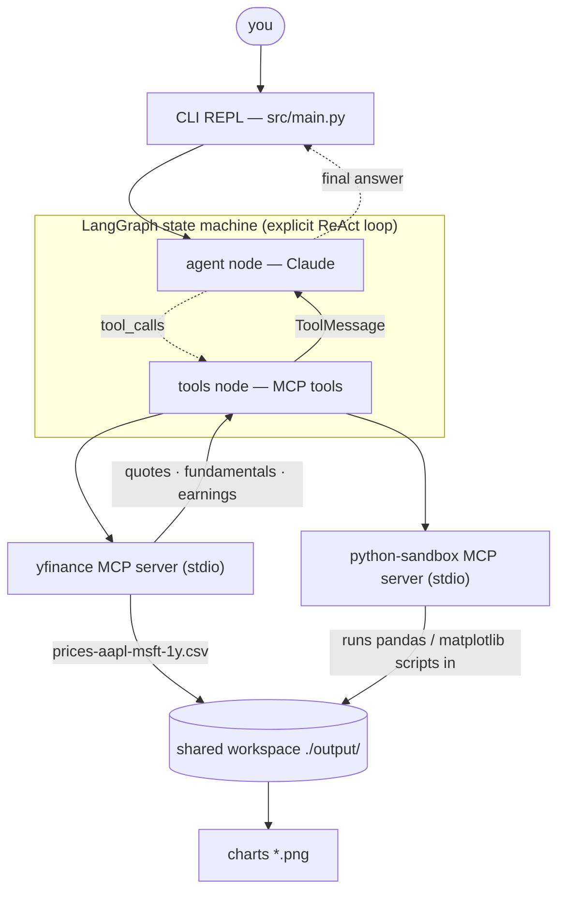

# Finance Research Agent — LangGraph + two composing MCP servers

A stock & finance research agent built with **LangGraph** (Python) whose entire
tool surface is **two MCP servers** that compose into an analytical pipeline:

1. **`yfinance` server** (keyless) — quotes, fundamentals, earnings surprises,
   and price history from Yahoo Finance,
2. **`python-sandbox` server** — runs model-written pandas/matplotlib code.

They meet in a shared workspace: the data server saves price history as a CSV
and returns only the *filename*; the sandbox runs with that workspace as its
working directory, loads the CSV with pandas, computes returns, and renders a
PNG chart. Bulk data flows through the filesystem, never through the model's
context window.



Ask things like:

- `Compare AAPL and MSFT over the last year and summarize the latest earnings surprises.`
- `What was NVDA's best month in 2025?`
- `Which of the two had the worse max drawdown?` *(follow-ups keep context)*

For the headline question the agent fetches a year of adjusted closes (saved to
CSV), pulls both companies' EPS estimate-vs-actual tables, computes total
return / volatility / drawdown with pandas in the sandbox, saves an
indexed-to-100 comparison chart to `output/`, and explains everything in prose.

## Why two MCP servers instead of framework tools?

The agent has **zero** framework-specific `@tool` definitions. Both servers are
discovered at runtime via
[`langchain-mcp-adapters`](https://pypi.org/project/langchain-mcp-adapters/)'
`MultiServerMCPClient`, and the LangGraph graph (`src/agent.py`) is an explicit
two-node ReAct state machine — `agent → tools → agent` — that doesn't know or
care where the tools come from. Swap or add servers in one config dict; the
same servers also work unchanged in Claude Desktop, Claude Code, or any other
MCP client.

Splitting *data access* from *computation* is the point of the demo: a typed,
keyless data API on one side, an open-ended code runner on the other, composing
through files in a shared workspace.

## ⚠️ Security note

The `python-sandbox` server is **process isolation, not a hardened jail**:
model-written Python runs on your machine with your user's permissions (fresh
subprocess, 90 s timeout, workspace cwd). Two deliberate hygiene measures: the
agent spawns both servers with a **scrubbed environment** (your
`ANTHROPIC_API_KEY` never reaches them), and the sandbox re-scrubs before each
run. Still — only feed it your own queries, and don't expose it to untrusted
input. If you need real isolation, run the server inside a container or use a
hosted sandbox.

## Prerequisites

- Python ≥ 3.11 and [uv](https://docs.astral.sh/uv/)
- An Anthropic API key

## Setup

```bash
uv sync
cp .env.example .env   # then put your real ANTHROPIC_API_KEY in .env
```

## Run

```bash
uv run src/main.py
```

Tool activity streams as dim `⚙` lines (for `run_python` you see the first line
of the generated script); final answers are highlighted; CSVs and charts land
in `output/`.

Type `exit` (or Ctrl-C / Ctrl-D) to quit.

## Project layout

| File | Role |
|---|---|
| `src/main.py` | CLI REPL: env check, streaming loop, per-turn file tracking |
| `src/agent.py` | MCP client → tools → explicit `StateGraph` + `InMemorySaver` |
| `src/prompt.py` | System prompt (pipeline, sandbox contract, chart spec, honesty rules) |
| `src/render.py` | Pretty-printing of stream updates (tool calls, results, answers) |
| `servers/yfinance_server.py` | FastMCP server: `get_quote`, `get_price_history` (→ CSV), `get_fundamentals`, `get_earnings_surprises` |
| `servers/sandbox_server.py` | FastMCP server: `run_python` (fresh subprocess, workspace cwd, scrubbed env) |

## Notes

- **Model**: `claude-opus-4-8` with adaptive thinking, via `langchain-anthropic`.
- **Memory**: `InMemorySaver` checkpoints conversation state per `thread_id`
  (one per REPL session, in-memory only), so follow-ups keep context.
- **Statelessness, twice**: the MCP adapter opens a fresh stdio session per
  tool call, and the sandbox runs each script in a fresh interpreter — so the
  system prompt demands fully self-contained scripts. Only the workspace
  persists, which is exactly what makes the CSV → pandas handoff work.
- **Chart style is in the prompt**: indexed-to-100 comparison on a single axis
  (never dual axes), a colorblind-safe palette, thin lines, light grid — so the
  generated matplotlib code is consistent run to run.
- **Data caveat**: Yahoo's endpoints are public but unofficial — expect
  occasional throttling; the agent is instructed to report fetch failures
  instead of guessing.
