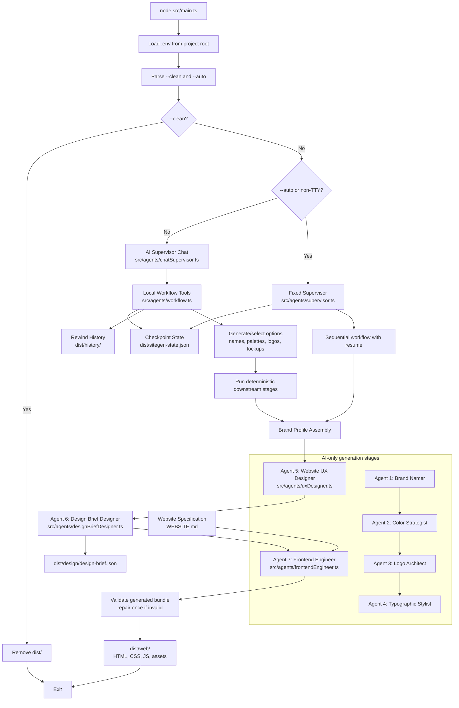

# SiteGen Agent

SiteGen Agent is a TypeScript CLI that turns a short business description into an AI-generated brand identity and a static corporate website. It guides the user through naming, palette selection, logo concepts, typography lockups, website UX planning, design brief creation, and frontend generation.

The project is designed for two audiences:

- Human developers who need a clear, inspectable local workflow.
- Codex and other AI agents that need explicit repository rules, generation constraints, and validation expectations.

Interactive runs use an AI supervisor chat that can generate options, ask for selections, resume checkpoints, plan rewinds, and restore archived snapshots. Non-interactive runs use a fixed workflow supervisor that resumes from saved state and automatically selects the first available option when `--auto` is supplied.

## What It Builds

The generated output is a polished static website and brand system under `dist/`:

- Three AI-generated brand name options.
- Three AI-generated palette options with preview SVGs.
- Three AI-generated safe SVG logo concepts constrained to the selected palette.
- Three AI-guided typography lockup SVGs.
- A UX and copy plan for Home, About, Contact, and optionally Projects.
- A design brief at `dist/design/design-brief.json`.
- A static website in `dist/web/` with HTML, CSS, JavaScript, and SVG assets.

Generated websites use semantic HTML5, responsive navigation, BEM-style CSS, unique page metadata, local-only assets, and visible references to both copied brand assets: `assets/logo.svg` and `assets/brand-lockup.svg`.

## Requirements

- Node.js `>=23.6`
- npm
- `OPENAI_API_KEY` for the full AI workflow

The CLI automatically loads `.env` from the project root.

```bash
OPENAI_API_KEY=sk-your-api-key
OPENAI_MODEL=gpt-5.5
SITEGEN_LOGO_MODEL=gpt-5.5
SITEGEN_TYPOGRAPHY_MODEL=gpt-5.5
SITEGEN_PALETTE_MODEL=gpt-5.5
SITEGEN_UX_MODEL=gpt-5.5
SITEGEN_FRONTEND_MODEL=gpt-5.5
SITEGEN_SUPERVISOR_MODEL=gpt-5.5
```

Only `OPENAI_API_KEY` is required. Model-specific environment variables are optional overrides.

## Commands

```bash
npm install
npm start
npm run dev
npm run check
npx tsc --noEmit
npm run clean
node src/main.ts --auto
```

`npm start` launches the AI supervisor chat in an interactive terminal. If no checkpoint exists, it asks for a business description and starts the generation workflow.

`node src/main.ts --auto` runs the fixed supervisor from an existing checkpoint and selects option 1 at selection prompts. It still requires OpenAI for AI-only stages.

`npm run clean` removes `dist/`. Use it before starting a different project.

## CLI Flow And Architecture



## Source Layout

```text
src/
├── main.ts                     # CLI entrypoint
├── agents/
│   ├── chatSupervisor.ts       # interactive AI chat supervisor
│   ├── workflow.ts             # local workflow tools and rewind/restore logic
│   ├── supervisor.ts           # fixed non-interactive supervisor
│   ├── brandNamer.ts           # AI brand naming
│   ├── colorStrategist.ts      # AI palette generation and preview SVGs
│   ├── logoArchitect.ts        # AI SVG logo generation and validation
│   ├── typographicStylist.ts   # AI typography suggestions and local lockup SVGs
│   ├── uxDesigner.ts           # AI website UX and copy plan
│   ├── designBriefDesigner.ts  # local design brief writer
│   ├── frontendEngineer.ts     # AI static website generation and validation
│   └── types.ts                # shared workflow types
└── utils/
    ├── chatState.ts
    ├── cli.ts
    ├── fs.ts
    ├── json.ts
    ├── openai.ts
    ├── state.ts
    └── svg.ts
```

## Generated Output

```text
dist/
├── brand/
│   ├── palette_*.svg
│   ├── logo_*.svg
│   └── name_*.svg
├── design/
│   └── design-brief.json
├── history/
│   └── rev-*/
├── sitegen-state.json
├── sitegen-chat.json
└── web/
    ├── index.html
    ├── about.html
    ├── projects.html        # only when portfolio content is appropriate
    ├── contact.html
    ├── styles.css
    ├── script.js
    └── assets/
```

`dist/` is generated output and can be deleted safely with `npm run clean`.

## Workflow Details

The workflow starts with a business description, then proceeds through selectable and deterministic stages:

1. Generate exactly three company names and select one.
2. Generate exactly three color palettes and write preview SVGs to `dist/brand/`.
3. Select one palette and delete rejected palette previews.
4. Generate exactly three safe SVG logos using only the selected primary and secondary colors.
5. Select one logo and delete rejected logo files.
6. Generate exactly three typography lockups using only the selected primary or secondary color.
7. Select one lockup and delete rejected lockups.
8. Assemble the brand profile.
9. Generate a UX and copy plan.
10. Write the design brief.
11. Generate, validate, and write the static website.

Checkpoint state is saved to `dist/sitegen-state.json` after completed stages and selections. If the process is interrupted, the next run resumes from the saved checkpoint and reuses completed artifacts.

The AI supervisor can also plan rewinds. A confirmed rewind archives the current state and generated artifacts under `dist/history/`, clears affected downstream state, and lets the user regenerate or reselect from the target stage.

## Website Output Contract

Generated websites are static and local-only. They must include:

- Home, About, and Contact pages.
- A Projects page only when the UX plan identifies real portfolio-style work.
- A capabilities section on Home when there is no Projects page.
- Persistent header navigation and shared footer.
- Responsive hamburger navigation.
- Static contact form fields for name, email, subject, and message.
- Unique title and meta description on every page.
- BEM-style CSS selectors.
- Selected palette colors used visibly across major surfaces.
- Business-aligned SVG placeholder assets when imagery is needed.
- No remote scripts, stylesheets, images, analytics, APIs, or runtime data calls.

The frontend generator validates the OpenAI-produced bundle and makes one repair attempt before failing clearly.

## Contributing With Codex

`AGENTS.md` is the working contract for Codex AI agents. Human contributors should keep this README focused on product orientation, setup, and architecture, while `AGENTS.md` should stay concise and instruction-heavy.

When asking Codex to make changes:

- Tell it to read `AGENTS.md` before editing.
- Include whether the change affects generated website behavior, workflow state, AI prompts, validation, or docs.
- Expect Codex to run `npm run check` and `npx tsc --noEmit` when TypeScript changes are made.
- Review any generated-output impact before committing.

Documentation protocol for all contributors: every new feature must update the Mermaid diagram in this README when command flow, architecture, workflow stages, or generated outputs change. Logic changes that affect agent behavior, validation, state, file layout, commands, or generated output rules must also be reflected in `AGENTS.md`.
